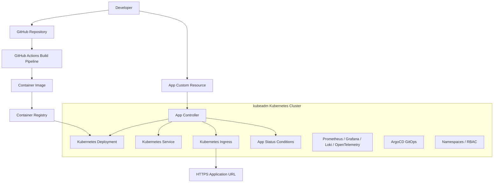

# Kubernetes Platform

A production-style Kubernetes platform built from the ground up with `kubeadm`, then extended with Kubernetes-native APIs using CRDs and controllers.

This project is designed to demonstrate more than application deployment. It shows how Kubernetes clusters are assembled, operated, extended, and used as the foundation for a developer platform similar in spirit to Railway or Render.

## Project Goal

Build a platform where users can deploy GitHub repositories into Kubernetes with a higher-level `App` API. The platform should eventually build container images, push them to a registry, provision Kubernetes resources, expose applications over HTTPS, and provide observability through Prometheus, Grafana, Loki, and OpenTelemetry.

The core engineering statement for this repo:

> I built a Kubernetes cluster from scratch, then built a Kubernetes-native platform on top of it using CRDs and controllers.

## Architecture



## Current Status

### Completed

- Built the first Kubernetes-native platform API with a Go/Kubebuilder `App` CRD.
- Implemented an `App` controller that reconciles `App` resources into `Deployment`, `Service`, and optional `Ingress` objects.
- Added controller status reporting with phase, URL, and Kubernetes-style conditions.
- Added focused controller tests using `envtest`.
- Added a kubeadm infrastructure foundation with scripts, config templates, validation, and operational runbooks.
- Initialized and pushed the private GitHub repository.

### In Progress / Planned

- Execute the kubeadm setup against real control-plane and worker nodes.
- Install and document the cluster networking layer, likely Cilium.
- Add ingress-nginx and cert-manager for HTTPS application exposure.
- Add GitHub Actions for image builds and pushes.
- Add a container registry workflow, likely GHCR first.
- Add ArgoCD for GitOps-based platform deployment.
- Add Prometheus, Grafana, Loki, and OpenTelemetry.
- Add namespace and RBAC isolation for multiple users.
- Add a polished platform API and CLI or web entry point for one-click deployments.

## Repository Structure

```text
.
├── docs/
│   ├── architecture-and-roadmap.md
│   └── superpowers/
│       ├── plans/
│       └── specs/
├── infra/
│   └── kubeadm/
│       ├── configs/
│       ├── runbooks/
│       └── scripts/
└── platform/
    └── app-controller/
        ├── api/
        ├── cmd/
        ├── config/
        ├── internal/
        └── test/
```

## Main Components

### kubeadm Cluster Foundation

The `infra/kubeadm` directory contains the foundation for building a Kubernetes cluster without using a managed service like EKS, GKE, or AKS.

It covers:

- Linux node prerequisites.
- containerd installation and configuration.
- Kubernetes package installation.
- First control-plane initialization.
- Additional control-plane and worker joins.
- Cluster validation.
- etcd backup and restore runbooks.
- Node troubleshooting runbooks.

This part of the project exists to build operational understanding of Kubernetes itself: control plane components, kubelet, container runtime integration, networking prerequisites, certificates, etcd, and node lifecycle.

### App CRD and Controller

The `platform/app-controller` directory contains a Go controller built with Kubebuilder and `controller-runtime`.

The current `App` API lets a user declare application intent:

```yaml
apiVersion: platform.sarige.dev/v1alpha1
kind: App
metadata:
  name: example-app
spec:
  image: ghcr.io/example/app:latest
  port: 8080
  replicas: 2
  host: example.local
```

The controller turns that intent into Kubernetes primitives:

- `Deployment` for running application pods.
- `Service` for stable in-cluster networking.
- `Ingress` for HTTP routing when a host is provided.
- `status` conditions so users can understand reconciliation state.

This is the Kubernetes-native part of the platform. Instead of writing scripts that imperatively create resources, the platform defines a desired state API and lets a controller continuously reconcile the cluster toward that state.

## Running The Current Code

Run controller tests:

```bash
cd platform/app-controller
make test
```

Inspect the sample `App` resource:

```bash
cat platform/app-controller/config/samples/platform_v1alpha1_app.yaml
```

Review the kubeadm cluster setup:

```bash
less infra/kubeadm/README.md
```

Validate kubeadm shell scripts:

```bash
bash -n infra/kubeadm/scripts/*.sh
```

## Why This Matters

Real platform engineering teams rarely ask every developer to understand every Kubernetes object in detail. Instead, they build higher-level internal platforms that turn common deployment workflows into safe, repeatable APIs.

This project follows that model:

- `kubeadm` teaches how Kubernetes is assembled and operated below the managed-service layer.
- CRDs teach how teams extend Kubernetes with domain-specific APIs.
- Controllers teach the reconciliation model that powers Kubernetes itself.
- GitOps teaches how production clusters are changed through version-controlled desired state.
- Observability teaches how teams operate distributed systems after deployment.
- RBAC and namespaces teach how platforms isolate teams and workloads.

The end result is not just "I deployed an app to Kubernetes." The stronger claim is: "I understand Kubernetes as both infrastructure and a programmable platform."

## Roadmap

### Milestone 1: Platform Architecture

- Define the target architecture.
- Explain core technology choices.
- Create a recruiter-facing roadmap.

### Milestone 2: Kubernetes-Native API

- Build the `App` CRD.
- Implement the Go controller.
- Reconcile Deployments, Services, and Ingresses.
- Report useful status conditions.

### Milestone 3: kubeadm Cluster

- Prepare Linux nodes.
- Install containerd and Kubernetes packages.
- Bootstrap the first control plane.
- Join workers.
- Validate core cluster health.

### Milestone 4: Networking and HTTPS

- Install a CNI.
- Install ingress-nginx.
- Add cert-manager.
- Expose applications over HTTPS.

### Milestone 5: Build and Registry Pipeline

- Build application images from GitHub repositories.
- Push images to a registry.
- Connect image output to the `App` API.

### Milestone 6: GitOps

- Install ArgoCD.
- Deploy platform components through GitOps.
- Document promotion and rollback workflows.

### Milestone 7: Observability

- Install Prometheus and Grafana.
- Add Loki for logs.
- Add OpenTelemetry instrumentation and traces.
- Build dashboards for platform and app health.

### Milestone 8: Multi-Tenancy

- Add namespace-per-user or namespace-per-project isolation.
- Add RBAC policies.
- Define safe defaults for resource requests, limits, secrets, and network access.

## Technology Stack

- Kubernetes
- kubeadm
- containerd
- Go
- Kubebuilder
- controller-runtime
- CustomResourceDefinitions
- GitHub Actions
- ArgoCD
- Prometheus
- Grafana
- Loki
- OpenTelemetry
