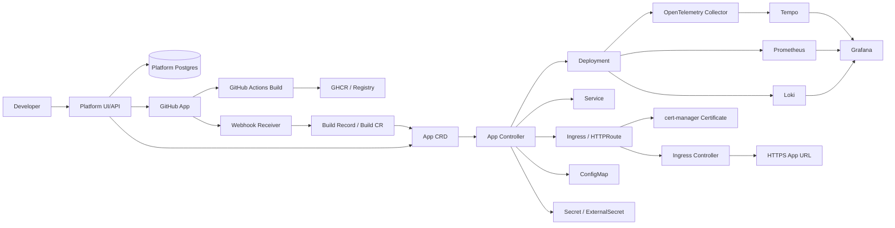
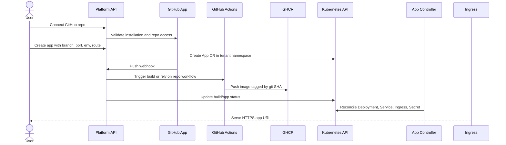
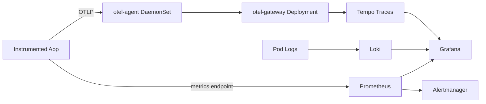

# Kubernetes Platform Portfolio: Architecture and Roadmap

Date: 2026-07-16

## Purpose

Build a production-style Kubernetes platform from scratch with `kubeadm`, then layer a small Railway/Render-like developer platform on top of it.

The point is not just to deploy apps. The point is to understand and demonstrate:

- Kubernetes cluster bootstrapping and operations.
- Networking, ingress, TLS, storage, RBAC, and multi-tenancy.
- Declarative platform APIs through CRDs and controllers.
- CI/CD, GitOps, observability, and production failure handling.
- Clear technical judgment recruiters can inspect quickly.

## Executive Architecture



## Recommended Baseline

Use a `kubeadm` cluster with 3 control-plane nodes using stacked etcd and 2-3 worker nodes.

Why: this is complex enough to demonstrate real Kubernetes operations, but not so complex that the project becomes mostly machine management. External etcd is more isolated, but requires more nodes and more failure modes. A single-node cluster is acceptable for local development, not for the final portfolio story.

Suggested lab topology:

| Role | Count | Size | Responsibility |
|---|---:|---|---|
| Control plane | 3 | 2 vCPU, 4-8 GB RAM, SSD | API server, scheduler, controller-manager, etcd |
| Workers | 2-3 | 4 vCPU, 8-16 GB RAM, SSD | Platform services, tenant apps, observability |
| API load balancer | 1-2 | Small VM | Stable endpoint for control plane |
| Optional storage nodes | 3 | Worker-sized with extra disk | Longhorn or other replicated storage |

Core choices:

| Area | Choice | Why |
|---|---|---|
| Runtime | `containerd` | Standard CRI runtime; Docker shim is gone |
| CNI | Cilium | Strong NetworkPolicy support, eBPF, Hubble visibility |
| Bare-metal service LB | MetalLB L2 | Gives `LoadBalancer` services without a managed cloud |
| Ingress | ingress-nginx first, Gateway API later | Ingress is easier to start; Gateway API is the cleaner platform abstraction |
| TLS | cert-manager + Let's Encrypt | Standard automated certificate lifecycle |
| Storage | local-path first, Longhorn later if needed | Avoid letting storage dominate the project early |
| GitOps | ArgoCD | Declarative cluster state, visible sync status |
| Registry | GHCR | Best fit for GitHub-first portfolio |
| Build v1 | GitHub Actions | Fastest reliable path; builds run outside cluster |
| Build v2 | Rootless BuildKit in-cluster | More platform-native once the deploy model is stable |

## Kubernetes Foundation

The cluster should be bootstrapped manually enough that you learn the moving parts, then captured in scripts and docs so it is reproducible.

Bootstrap order:

1. Prepare nodes: static IPs or stable DNS, time sync, kernel modules, sysctl, swap handling, `containerd`, `kubeadm`, `kubelet`, `kubectl`.
2. Create the API server load balancer: HAProxy/keepalived in a home lab or a TCP load balancer in cloud.
3. Run `kubeadm init` with a config file and `controlPlaneEndpoint`.
4. Install Cilium before expecting pods to become healthy.
5. Join the remaining control-plane nodes and workers.
6. Install MetalLB or cloud load balancer integration.
7. Install ingress-nginx, cert-manager, a default StorageClass, and Metrics Server.
8. Add tenant namespace templates, RBAC, quotas, LimitRanges, Pod Security labels, and NetworkPolicies.

Production practices to demonstrate:

- Keep etcd on fast disks and document snapshot/restore.
- Use 3 control-plane nodes, not 2.
- Keep control-plane nodes tainted unless resource constraints force otherwise.
- Use default-deny NetworkPolicies in tenant namespaces.
- Restrict tenant RBAC to namespaced resources.
- Enforce `restricted` Pod Security where possible.
- Do not expose the Kubernetes API publicly without VPN/firewalling.

## Platform Layer

Build the platform as a control plane, not as shell scripts that imperatively create Kubernetes objects.

Main services:

| Service | Responsibility |
|---|---|
| `api-server` | Users, teams, app creation, GitHub App install, environment variables, deploy history |
| `webhook-receiver` | Verify GitHub webhook signatures and trigger builds |
| `app-controller` | Watch `App` CRs and reconcile Kubernetes runtime resources |
| `build-controller` | Track build lifecycle; v1 may mostly observe GitHub Actions |
| `status-aggregator` | Optional later service to normalize pod, rollout, route, and build states |
| Postgres | Platform metadata, not Kubernetes desired state |

Do not use Kubernetes as the primary application database. Use Kubernetes CRDs for desired state and runtime status; use Postgres for users, teams, app metadata, GitHub installations, audit logs, build records, and deploy history.

### User Flow



### App CRD Draft

```yaml
apiVersion: platform.example.com/v1alpha1
kind: App
metadata:
  name: my-app
  namespace: team-abc
spec:
  source:
    provider: github
    repo: owner/repo
    branch: main
    rootDir: .
    githubInstallationId: "12345"
  build:
    strategy: githubActions
    dockerfile: Dockerfile
  image:
    registry: ghcr.io
    repository: owner/my-app
    tagPolicy: gitSha
  runtime:
    replicas: 1
    port: 3000
    healthCheck:
      path: /health
    resources:
      requests:
        cpu: 100m
        memory: 256Mi
      limits:
        cpu: 500m
        memory: 512Mi
  routes:
    - host: my-app.platform.example.com
      tls: true
  config:
    secretRefs:
      - app-env
    configMapRefs:
      - app-config
status:
  phase: Live
  observedGeneration: 3
  latestBuild:
    commit: abc123
    image: ghcr.io/owner/my-app@sha256:...
    status: Succeeded
  url: https://my-app.platform.example.com
  conditions:
    - type: Ready
      status: "True"
    - type: Reconciling
      status: "False"
    - type: Stalled
      status: "False"
```

Controller responsibilities:

- Add a finalizer for cleanup.
- Validate the spec and set clear conditions.
- Reconcile Deployment, Service, Ingress or HTTPRoute, Certificate, ConfigMap, Secret, and optional HPA.
- Set owner references where appropriate.
- Update status from child resources.
- Keep build failures, deploy failures, and runtime failures separate.

Failure states worth modeling:

- `GitHubAuthFailed`
- `BuildQueued`
- `BuildRunning`
- `BuildFailed`
- `ImagePushFailed`
- `ImagePullBackOff`
- `ConfigInvalid`
- `DeployProgressing`
- `DeployFailed`
- `CrashLoopBackOff`
- `HealthCheckFailed`
- `TLSPending`
- `RouteConflict`
- `QuotaExceeded`
- `Suspended`
- `Deleting`

## Multi-Tenancy And Security

Use namespace-based soft multi-tenancy for the portfolio version.

Per tenant/environment namespace:

- Namespace: `team-a-dev`, `team-a-prod`.
- Role/RoleBinding for tenant users and platform service accounts.
- ResourceQuota for CPU, memory, pods, services, and PVCs.
- LimitRange for default requests and limits.
- Default-deny NetworkPolicy.
- Explicit ingress from ingress controller.
- Explicit egress to DNS.
- Pod Security Admission labels.

Do not allow tenant workloads to use:

- `cluster-admin`
- Privileged pods
- `hostPath`
- `hostNetwork`
- Arbitrary RBAC escalation
- Shared Docker socket builds

Important architectural warning: in-cluster builds execute untrusted repository code. Treat build namespaces as hostile. Use rootless BuildKit, strict RBAC, resource quotas, NetworkPolicies, and no host mounts.

## Observability

Use OpenTelemetry as the standard telemetry API and collection layer.

Recommended layout:



Stack:

- `kube-prometheus-stack` for Prometheus Operator, Alertmanager, Grafana, node exporter, kube-state-metrics, CRDs, dashboards, and alerts.
- Loki for logs.
- Tempo for traces.
- OpenTelemetry Collector in agent and gateway modes.
- Grafana dashboards committed to Git and deployed by ArgoCD.

SLO examples:

- App availability: 99.5% successful HTTP requests over 30 days.
- App latency: 95% of requests below 300 ms.
- Platform health: ArgoCD apps synced, ingress error rate low, Prometheus targets healthy, Loki/Tempo ingestion working.

Runbooks should live in `docs/runbooks/` and be linked from alert annotations.

## GitOps And CI/CD

ArgoCD owns cluster state. GitHub Actions validates, builds, scans, and proposes changes.

Recommended flow:

1. Developer pushes to GitHub.
2. GitHub Actions runs tests and builds an image.
3. Image is pushed to GHCR with a commit SHA tag.
4. Actions opens a PR updating the GitOps environment overlay.
5. Merge triggers ArgoCD reconciliation.
6. ArgoCD deploys and reports sync/health status.

Use ArgoCD ApplicationSets for scalable environment patterns. Use app-of-apps only for simple bootstrap and document that it is an admin-controlled root.

Suggested sync waves:

1. CRDs and operators.
2. Secret management.
3. Ingress and cert-manager.
4. Observability backends.
5. OpenTelemetry collectors.
6. Workloads.
7. Dashboards and alerts.

## Repository Structure

```text
kubernetes-platform-portfolio/
  README.md
  Makefile
  docs/
    architecture-and-roadmap.md
    architecture.md
    decisions/
    diagrams/
    gitops.md
    observability.md
    runbooks/
    slo-alerting.md
  infra/
    kubeadm/
    nodes/
    metallb/
    ingress-nginx/
    cert-manager/
    cilium/
    storage/
  platform/
    api-server/
    app-controller/
    webhook-receiver/
    build-controller/
    crds/
    charts/
  gitops/
    bootstrap/
      argocd/
    clusters/
      local/
      staging/
      production/
    apps/
      platform/
      observability/
      demo-api/
  apps/
    demo-api/
    demo-worker/
  scripts/
  .github/
    workflows/
```

Recruiter-facing README sections:

- What this platform does.
- Architecture diagram.
- Tech stack table.
- 5-minute demo path.
- Production practices demonstrated.
- Tradeoffs and future work.
- Screenshots: ArgoCD, Grafana, TLS app, trace/log correlation.

## 1-2 Week Implementation Roadmap

This is intentionally aggressive. The goal for the first 1-2 weeks is a strong vertical slice: repo skeleton, local controller development loop, `App` CRD/controller, HTTPS demo app path, and the foundation for GitOps. The full final platform will continue beyond this window.

For momentum and recruiter signal, build the Kubernetes-native controller before the full kubeadm migration:

1. Minimal local cluster with kind for fast controller development.
2. App CRD/controller in Go.
3. Reconcile Deployment, Service, and Ingress.
4. Add GitHub Actions image build.
5. Add observability/GitOps.
6. Build kubeadm production-style cluster.
7. Move the working platform onto the kubeadm cluster.

### Milestone 0: Project Framing And Repo Skeleton

Target: half day.

Deliverables:

- Create repository structure.
- Write README draft.
- Add architecture diagram and this roadmap.
- Create decision records for major choices: kubeadm, Cilium, ArgoCD, GitHub Actions, GHCR, cert-manager.

Why it exists: documentation is part of the product. A recruiter should understand the system before reading code.

Thinking question: what is the smallest demo that proves you understand platform engineering, not just YAML?

### Milestone 1: App CRD Controller

Target: 2-3 days.

Deliverables:

- Go Kubebuilder project under `platform/app-controller`.
- `App` CRD v1alpha1.
- Controller reconciles Deployment, Service, and optional Ingress.
- Status conditions show `Ready`, `Reconciling`, and `Stalled`.
- Tests cover resource construction and controller behavior.
- Local demo commands documented.

Why it exists: this proves the platform is Kubernetes-native, not just a pile of YAML. The CRD is the platform API; the controller is what turns desired state into real Kubernetes resources.

Review checkpoint:

- Why use a CRD instead of directly creating Deployments from an API server?
- What belongs in `spec` vs `status`?
- How does a reconciliation loop repair drift?
- Why do owner references matter?

Repo entry point: `platform/app-controller/README.md`.

### Milestone 1.5: Local kind Controller Demo

Target: half day.

Deliverables:

- Disposable kind cluster config under `infra/kind`.
- Scripts to create the cluster, install CRDs, run the controller locally, apply a sample `App`, and validate generated resources.
- Documentation that explains the local development loop and its production limitations.

Why it exists: controller work needs a fast feedback loop. kind lets you test the Kubernetes API contract locally before deploying the same controller onto the kubeadm-built cluster.

Review checkpoint:

- Why run the controller locally during development?
- What does this demo prove, and what does it intentionally not prove?
- Why is creating an Ingress object different from routing real HTTPS traffic?

Repo entry point: `infra/kind/README.md`.

### Milestone 2: kubeadm Cluster Foundation

Target: 2-3 days.

Deliverables:

- kubeadm foundation files under `infra/kubeadm`.
- 3 control-plane and 2-3 worker nodes, or a documented smaller fallback.
- `containerd` configured.
- `kubeadm` config committed.
- API server behind stable load balancer endpoint.
- Cilium installed and validated.
- Node labels/taints documented.
- etcd backup and restore runbook started.

Why it exists: Kubernetes is a distributed control plane. You need to understand the API server, etcd, scheduler, controller-manager, kubelet, CNI, and kube-proxy/Cilium networking before running your platform in a production-style environment.

Review checkpoint:

- Can you explain what happens when a Pod is created?
- Can you explain why etcd quorum matters?
- Can you debug `NodeNotReady`, CoreDNS failure, and pod-to-service routing?

Repo entry point: `infra/kubeadm/README.md`.

### Milestone 3: Cluster Add-ons And HTTPS Ingress

Target: 1-2 days.

Deliverables:

- MetalLB or cloud LoadBalancer integration.
- ingress-nginx installed.
- cert-manager installed.
- Staging and production ClusterIssuers.
- A demo app exposed through HTTPS.
- DNS and TLS troubleshooting notes.

Why it exists: user-facing platforms depend on reliable routing. Services, ingress, load balancers, DNS, and certificates are separate systems that must line up.

Review checkpoint:

- Can you explain ClusterIP vs NodePort vs LoadBalancer vs Ingress?
- Can you explain HTTP-01 vs DNS-01 certificate validation?
- Can you trace an HTTPS request from browser to pod?

### Milestone 4: GitOps Bootstrap

Target: 1 day.

Deliverables:

- ArgoCD installed.
- Root app or ApplicationSet bootstraps add-ons.
- Environment overlays for `local`, `staging`, and `production`.
- Sync waves for CRDs, operators, ingress, observability, and workloads.

Why it exists: production clusters should converge from Git, not from an operator's terminal history.

Review checkpoint:

- What should ArgoCD own?
- What should not be auto-synced?
- How do you recover if cluster state drifts from Git?

### Milestone 5: Platform API And Metadata

Target: 2-3 days.

Deliverables:

- Platform API can create an app record and corresponding `App` CR.
- Postgres schema for users, teams, apps, deploys, and GitHub installations.
- API validates app creation requests before writing `App` resources.
- API reads `App` status for deploy visibility.

Why it exists: the controller is the Kubernetes-native runtime layer, but users still need a clean product API for teams, repositories, app creation, and deploy history.

Review checkpoint:

- What belongs in Postgres vs Kubernetes?
- Why should the API create `App` resources instead of low-level Deployments?
- How should API auth map to namespace/RBAC boundaries?

### Milestone 6: GitHub-To-Image Build Path

Target: 1-2 days.

Deliverables:

- GitHub App or documented first-pass GitHub integration.
- Webhook receiver validates signatures.
- GitHub Actions workflow builds image.
- Image pushed to GHCR with commit SHA tag.
- Platform records build status.
- Controller deploys immutable image tag or digest.

Why it exists: the platform promise is "repo to running service." Build and deploy are distinct phases with different failure modes.

Review checkpoint:

- Why avoid Kaniko for new work?
- Why use immutable tags or digests?
- What permissions should GitHub Actions have?

### Milestone 7: HTTPS App Routing And Tenant Isolation

Target: 1-2 days.

Deliverables:

- App controller reconciles Ingress or HTTPRoute.
- cert-manager issues app certificate.
- Namespace template includes RBAC, ResourceQuota, LimitRange, Pod Security labels, and NetworkPolicies.
- Route conflict detection.
- Basic app environment variables through Secret and ConfigMap.

Why it exists: a multi-user platform must protect tenants from each other and from the platform control plane.

Review checkpoint:

- What isolation does a namespace provide?
- What isolation does it not provide?
- How would a malicious user try to escape this model?

### Milestone 7: Observability Vertical Slice

Target: 2 days.

Deliverables:

- kube-prometheus-stack deployed.
- Grafana dashboard for app and cluster health.
- Loki collects app logs.
- Tempo receives traces.
- OpenTelemetry Collector receives app telemetry.
- One demo failure produces logs, metrics, traces, and an alert.

Why it exists: production systems are judged by how they fail and how quickly engineers can understand the failure.

Review checkpoint:

- Can you debug a 500 error from metric to logs to trace?
- What is the difference between metrics, logs, and traces?
- What alert would wake someone up, and what alert is just noise?

### Milestone 8: Polish And Portfolio Demo

Target: 1 day.

Deliverables:

- README polished.
- Diagrams committed.
- Demo script written.
- Screenshots added.
- Production-readiness checklist.
- Future roadmap: BuildKit, Gateway API, External Secrets, database provisioning, policy engine, image signing.

Why it exists: strong engineering work still needs to be legible. The portfolio should show judgment, not just tools.

Review checkpoint:

- Can a recruiter understand the project in 90 seconds?
- Can a senior engineer see the tradeoffs?
- Can you defend every major technology choice?

## Final Milestone Review Template

Use this after each milestone:

1. What was built?
2. What Kubernetes components did this exercise?
3. What broke or was confusing?
4. What production best practice did we apply?
5. What shortcuts did we knowingly take?
6. What would a real company do differently?
7. What code or manifests should be refactored?
8. What interview questions should you now be able to answer?
9. What is the next milestone?

## Interview Question Bank

- What does `kubeadm` install, and what does it not install?
- Why does Kubernetes need a CNI?
- What is stored in etcd?
- What happens during a Deployment rollout?
- How does a Service route traffic to Pods?
- Why are readiness and liveness probes different?
- How does cert-manager prove domain ownership?
- What is the difference between Ingress and Gateway API?
- Why use CRDs and controllers for a platform?
- What belongs in Kubernetes and what belongs in Postgres?
- What are finalizers and owner references?
- How do NetworkPolicies work, and when do they not work?
- Why are in-cluster builds risky?
- What does GitOps solve, and what does it not solve?
- How do metrics, logs, and traces complement each other?

## Notion Organization

No Notion connector is available in this Codex session, so this file is written as a Notion-ready import document.

Suggested Notion structure:

- Page: Kubernetes Platform Portfolio
  - Architecture Overview
  - Roadmap
  - Milestone Reviews
  - Decision Records
  - Runbooks
  - Interview Prep
  - Demo Assets

Create one Notion database for milestones with these properties:

| Property | Type |
|---|---|
| Milestone | Title |
| Status | Select: Not Started, In Progress, Review, Done |
| Target Date | Date |
| Kubernetes Concepts | Multi-select |
| Deliverables | Text |
| Review Notes | Text |
| Interview Questions | Text |
| Next Action | Text |

## Early Architectural Decisions

1. Use `kubeadm`, not managed Kubernetes, because the cluster itself is part of the learning goal.
2. Use Cilium first unless kernel or environment constraints force Calico.
3. Start with GitHub Actions for builds; add rootless BuildKit later.
4. Use GHCR for v1 image registry.
5. Use CRDs/controllers for app desired state.
6. Use Postgres for platform metadata.
7. Use namespace-based soft multi-tenancy, clearly documenting its limits.
8. Use ArgoCD for cluster reconciliation.
9. Use OpenTelemetry, Prometheus, Grafana, Loki, and Tempo for observability.
10. Avoid Kaniko for new work because it is archived and no longer a good default.
