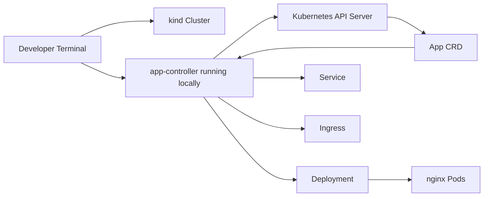

# kind Local Controller Demo Design

Date: 2026-08-02

## Goal

Create a repeatable local validation path for the `App` CRD/controller before running it on the kubeadm cluster.

This milestone is intentionally smaller than the production cluster path. It exists to make controller development fast: create a disposable Kubernetes cluster, install the CRD, run the controller locally, apply a sample `App`, and verify the generated Kubernetes resources.

## Why kind Exists Here

`kind` runs Kubernetes nodes as Docker containers. It is not the production target for this project, but it gives a fast feedback loop for controller development.

Production target:

- kubeadm-built cluster.
- Real nodes.
- Cilium, ingress-nginx, cert-manager, GitOps, observability.

Local development target:

- kind cluster.
- Host-running controller process.
- Sample `App` resource.
- Validation of Deployment, Service, Ingress, and status behavior.

## Architecture

## Workflow

1. Create a local kind cluster named `kubernetes-platform`.
2. Install the `App` CRD into the cluster.
3. Run the controller locally using the current kubeconfig.
4. Apply the sample `App`.
5. Validate that the controller created the expected Kubernetes resources.

## Tradeoffs

- Running the controller locally is simpler than building and loading a controller image into kind. It is the right first development loop.
- The demo creates an Ingress object but does not install ingress-nginx yet. HTTPS ingress belongs in the next networking milestone.
- The sample uses `nginx` because it removes application complexity from the controller validation path.

## Success Criteria

- Scripts are idempotent where reasonable.
- Missing prerequisites fail with clear messages.
- The demo path is documented from a clean repo checkout.
- Static checks validate shell scripts and YAML.
