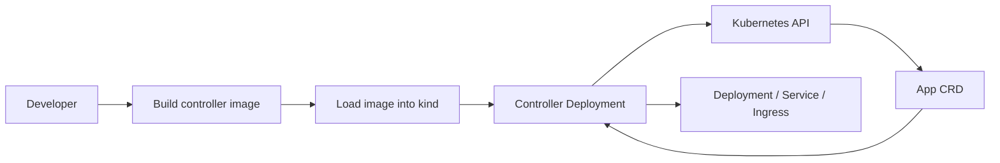

# kind In-Cluster Controller Deployment Design

Date: 2026-08-03

## Goal

Deploy the `app-controller` into the local kind cluster as a real Kubernetes workload.

The previous kind milestone validated the controller by running it from the host with `make run`. This milestone moves one step closer to production: the controller runs inside Kubernetes with a ServiceAccount, RBAC, leader election, health probes, and a container image loaded into the kind node.

## Why This Exists

Running a controller locally is the right development loop, but production controllers run in the cluster. They need:

- A container image.
- A Kubernetes Deployment.
- A ServiceAccount and RBAC permissions.
- Health and readiness probes.
- Leader election configuration.
- A repeatable deployment command.

This milestone proves that the `App` API is not just testable from a laptop. It can be packaged and operated like real Kubernetes platform software.

## Architecture

## Workflow

1. Create the kind cluster if it does not exist.
2. Build `app-controller:kind` locally.
3. Load the image into the kind cluster.
4. Deploy the Kubebuilder manifests with `IMG=app-controller:kind`.
5. Wait for the controller Deployment to become available.
6. Apply the sample `App`.
7. Validate generated `Deployment`, `Service`, `Ingress`, and `App` status.

## Design Decisions

- Use `app-controller:kind`, not `latest`, because Kubernetes defaults `latest` images to `imagePullPolicy: Always`.
- Keep the existing Kubebuilder `make deploy` path instead of duplicating YAML under `infra/kind`.
- Keep kind scripts thin wrappers around the real build and deploy commands.
- Do not install ingress-nginx in this milestone. The controller should create the Ingress object, but actual HTTP routing comes next.

## Success Criteria

- The controller can be built as an image.
- The image can be loaded into kind.
- The controller Deployment becomes available.
- A sample `App` reconciles without a host-running controller process.
- Static script checks and controller tests pass.
