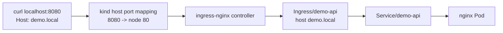

# kind HTTP Routing Design

Date: 2026-08-17

## Goal

Install ingress-nginx into the local kind cluster and prove that `Ingress/demo-api` routes HTTP traffic from the host to the sample nginx workload.

## Why This Exists

The controller already creates an Ingress object, but an Ingress object is only desired routing state. It does not move packets by itself.

An ingress controller is the running proxy/control-loop that watches Ingress resources and programs actual HTTP routing. This milestone teaches that distinction by adding ingress-nginx and validating a real request path.

## Architecture

## Design Decisions

- Use the upstream ingress-nginx kind manifest pinned to `controller-v1.15.1`.
- Keep this milestone HTTP-only; cert-manager and HTTPS come next.
- Validate with `curl -H 'Host: demo.local' http://localhost:8080/` to avoid `/etc/hosts` changes.
- Make the generated App Ingress explicit with `spec.ingressClassName: nginx`.
- Validate the whole resource chain: controller readiness, app rollout, Service endpoints, Ingress host/class, and HTTP response body.

## Success Criteria

- ingress-nginx controller pod becomes Ready.
- `IngressClass/nginx` exists.
- `Ingress/demo-api` has `spec.ingressClassName: nginx`.
- `Service/demo-api` has endpoints.
- Host-routed HTTP request returns the stock nginx welcome page.

## Out Of Scope

- HTTPS.
- cert-manager.
- Public DNS.
- Gateway API.
