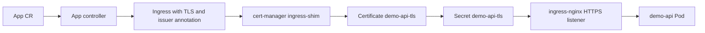

# Local HTTPS With cert-manager Design

Date: 2026-08-25

## Goal

Extend the local kind platform slice so an `App` can request HTTPS through Kubernetes-native APIs:

```yaml
spec:
  host: demo.local
  tls: true
```

The controller should translate that intent into an Ingress that cert-manager can process.

## Architecture



## Design Decisions

- Add `spec.tls` to the `App` CRD instead of asking users to write Ingress YAML.
- Keep the first implementation intentionally narrow: TLS only applies when `spec.host` is set.
- Use `cert-manager.io/cluster-issuer: platform-local-selfsigned` for kind.
- Name the TLS Secret `<app-name>-tls` so generated resources are predictable.
- Keep production issuer selection out of the first API shape; later milestones can add issuer policy, tenant defaults, and domain ownership rules.

## Why This Matters

ingress-nginx and cert-manager solve different problems:

- ingress-nginx routes HTTP/HTTPS traffic to Services.
- cert-manager creates, stores, and renews certificates.
- The App controller coordinates both by declaring the desired Ingress state.

This is the core platform-engineering pattern: expose a small product API, then reconcile the lower-level Kubernetes resources and add-ons behind it.

## Production Follow-ups

- Replace the self-signed issuer with Let's Encrypt, internal PKI, or cloud-managed certificates.
- Add DNS ownership and tenant boundary checks before allowing arbitrary hosts.
- Add status conditions for certificate readiness instead of marking the app Ready immediately after resource reconciliation.
- Support per-environment issuer policy through namespaces or platform configuration.
