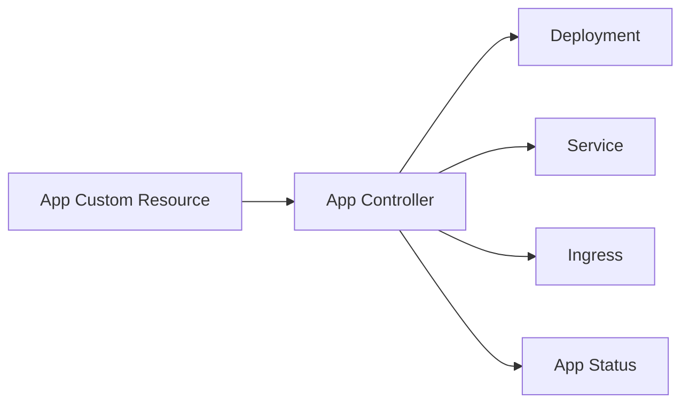

# kind Local Controller Demo

This directory contains the fastest way to validate the Kubernetes-native part of the platform.

`kind` is not the production target. The production-style cluster is built with `kubeadm` under `infra/kubeadm`. This workflow exists so controller changes can be tested quickly before moving them onto real nodes.

## What This Proves

The demo proves that the platform has its own Kubernetes API:



You are not manually applying Deployments and Services. You are declaring a higher-level `App`, and the controller reconciles lower-level Kubernetes resources.

## Prerequisites

- Docker running locally.
- `kind` installed.
- `kubectl` installed.
- Go installed.

On macOS:

```bash
brew install kind kubectl go
```

## Demo Flow

### Local Controller Development

From the repository root:

```bash
./infra/kind/scripts/00-create-cluster.sh
./infra/kind/scripts/01-install-controller-crds.sh
```

Run the controller in one terminal:

```bash
./infra/kind/scripts/02-run-controller-locally.sh
```

Apply the sample `App` from a second terminal:

```bash
./infra/kind/scripts/03-apply-sample-app.sh
./infra/kind/scripts/04-validate-app.sh
```

This path runs the controller from your host machine. It is the fastest loop while editing controller code.

### In-Cluster Controller Deployment

After the local loop works, deploy the controller into kind as a real Kubernetes workload:

```bash
./infra/kind/scripts/05-build-load-controller.sh
./infra/kind/scripts/06-deploy-controller.sh
./infra/kind/scripts/07-validate-controller-deployment.sh
```

This path builds a git-SHA-tagged local controller image, loads it into the kind node, deploys the Kubebuilder manifests, and validates that a sample `App` reconciles without `make run`.

### HTTP Routing Through ingress-nginx

After the controller is running in-cluster, install ingress-nginx and validate host-based HTTP routing:

```bash
./infra/kind/scripts/08-install-ingress-nginx.sh
./infra/kind/scripts/09-validate-http-routing.sh
```

This validates the full request path:

```text
curl -H 'Host: demo.local' http://localhost:8080/
-> kind host port mapping
-> ingress-nginx controller
-> Ingress/demo-api
-> Service/demo-api
-> nginx Pod
```

An `Ingress` object is only desired routing state. The ingress controller is the running proxy that watches those objects and implements the routing rules. Without ingress-nginx, `Ingress/demo-api` can exist but no HTTP traffic will be routed.

The sample app defaults to `spec.tls: true` for the HTTPS milestone. The HTTP validation script temporarily patches `spec.tls: false` so it can validate plain HTTP without ingress-nginx redirecting to HTTPS.

### Local HTTPS Through cert-manager

After HTTP routing works, install cert-manager and validate local HTTPS routing:

```bash
./infra/kind/scripts/10-install-cert-manager.sh
./infra/kind/scripts/11-validate-https-routing.sh
```

This validates the certificate path:

```text
App/demo-api spec.tls: true
-> Ingress/demo-api TLS block and cert-manager annotation
-> cert-manager ingress-shim
-> Certificate/demo-api-tls
-> Secret/demo-api-tls
-> ingress-nginx HTTPS listener
```

cert-manager exists because certificates are lifecycle-managed infrastructure. A platform should not ask developers to manually create TLS Secrets, renew certificates, or remember issuer-specific details. The controller declares that the app needs TLS; cert-manager turns that declaration into a certificate Secret.

The local kind path uses `ClusterIssuer/platform-local-selfsigned`. That is useful for learning and local validation, but browsers and curl will not trust it by default:

```bash
curl --insecure -H 'Host: demo.local' https://localhost:8443/
```

In production, replace the self-signed issuer with Let's Encrypt, an internal PKI issuer, or a cloud certificate manager. Public Let's Encrypt normally also requires real DNS plus HTTP-01 or DNS-01 ownership validation.

## Latest Validation

Last verified local runtime path:

- kind cluster `kubernetes-platform` created successfully.
- `app-controller:kind` image loaded into the kind control-plane node.
- `app-controller-controller-manager` Deployment rolled out in `app-controller-system`.
- `App/demo-api` reconciled into `Deployment/demo-api`, `Service/demo-api`, and `Ingress/demo-api`.
- `Deployment/demo-api` rolled out successfully.
- HTTP routing through ingress-nginx reached the sample nginx app.

## Expected Resources

The sample creates an `App` named `demo-api`. The controller should reconcile:

- `Deployment/demo-api`
- `Service/demo-api`
- `Ingress/demo-api`
- `Certificate/demo-api-tls` and `Secret/demo-api-tls` when cert-manager is installed
- `App/demo-api` status conditions

Inspect the app:

```bash
kubectl get app demo-api -o yaml
```

Inspect the generated workload:

```bash
kubectl get deployment,service,ingress demo-api
kubectl describe app demo-api
```

## Why The Controller Runs Locally

During controller development, the tightest loop is:

1. Edit Go code.
2. Run tests.
3. Run the controller locally.
4. Apply a sample CR.
5. Inspect reconciled resources.

Later, the controller will be built into an image and deployed into the cluster through GitOps. That is a different milestone.

## Why The Controller Runs In-Cluster

A production controller is itself a Kubernetes workload. Running it in-cluster proves:

- The controller image can be built and shipped.
- RBAC permissions are sufficient.
- The Deployment, ServiceAccount, and leader election configuration work.
- Health and readiness probes are wired.
- Reconciliation does not depend on a developer terminal staying open.

## Production Tradeoffs

This local setup intentionally simplifies several production concerns:

- Local TLS uses a self-signed ClusterIssuer, not a trusted public CA.
- No namespace/RBAC tenant isolation is installed yet.
- No registry or build pipeline is involved yet.

Tenant isolation and build pipelines belong in later milestones. This milestone focuses on proving that the platform API can drive local HTTP and HTTPS routing through Kubernetes-native add-ons.

## Troubleshooting HTTP Routing

- `connection refused` on `localhost:8080`: the kind cluster is missing host port mapping or ingress-nginx is not ready.
- HTTP `404`: the Host header or Ingress rule does not match.
- HTTP `503`: the Service has no ready endpoints.
- Ingress ignored: verify `Ingress/demo-api` has `ingressClassName: nginx` and `IngressClass/nginx` exists.

## Troubleshooting HTTPS Routing

- `certificate demo-api-tls not found`: verify the Ingress has the `cert-manager.io/cluster-issuer` annotation.
- Certificate stuck `Pending`: run `kubectl describe certificate demo-api-tls` and inspect cert-manager logs.
- TLS Secret missing: verify `ClusterIssuer/platform-local-selfsigned` exists and cert-manager webhook is ready.
- curl certificate warning: expected locally because the issuer is self-signed; use `--insecure` for this kind-only validation path.
