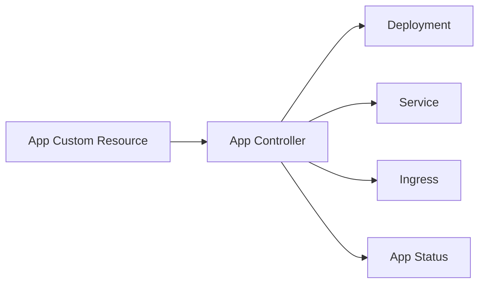

# kind Local Controller Demo

This directory contains the fastest way to validate the Kubernetes-native part of the platform.

`kind` is not the production target. The production-style cluster is built with `kubeadm` under `infra/kubeadm`. This workflow exists so controller changes can be tested quickly before moving them onto real nodes.

## What This Proves

The demo proves that the platform has its own Kubernetes API:



You are not manually applying Deployments and Services. You are declaring a higher-level `App`, and the controller reconciles lower-level Kubernetes resources.

## Prerequisites

- Docker running locally.
- `kind` installed.
- `kubectl` installed.
- Go installed.

On macOS:

```bash
brew install kind kubectl go
```

## Demo Flow

### Local Controller Development

From the repository root:

```bash
./infra/kind/scripts/00-create-cluster.sh
./infra/kind/scripts/01-install-controller-crds.sh
```

Run the controller in one terminal:

```bash
./infra/kind/scripts/02-run-controller-locally.sh
```

Apply the sample `App` from a second terminal:

```bash
./infra/kind/scripts/03-apply-sample-app.sh
./infra/kind/scripts/04-validate-app.sh
```

This path runs the controller from your host machine. It is the fastest loop while editing controller code.

### In-Cluster Controller Deployment

After the local loop works, deploy the controller into kind as a real Kubernetes workload:

```bash
./infra/kind/scripts/05-build-load-controller.sh
./infra/kind/scripts/06-deploy-controller.sh
./infra/kind/scripts/07-validate-controller-deployment.sh
```

This path builds `app-controller:kind`, loads it into the kind node, deploys the Kubebuilder manifests, and validates that a sample `App` reconciles without `make run`.

## Latest Validation

Last verified local runtime path:

- kind cluster `kubernetes-platform` created successfully.
- `app-controller:kind` image loaded into the kind control-plane node.
- `app-controller-controller-manager` Deployment rolled out in `app-controller-system`.
- `App/demo-api` reconciled into `Deployment/demo-api`, `Service/demo-api`, and `Ingress/demo-api`.
- `Deployment/demo-api` rolled out successfully.

## Expected Resources

The sample creates an `App` named `demo-api`. The controller should reconcile:

- `Deployment/demo-api`
- `Service/demo-api`
- `Ingress/demo-api`
- `App/demo-api` status conditions

Inspect the app:

```bash
kubectl get app demo-api -o yaml
```

Inspect the generated workload:

```bash
kubectl get deployment,service,ingress demo-api
kubectl describe app demo-api
```

## Why The Controller Runs Locally

During controller development, the tightest loop is:

1. Edit Go code.
2. Run tests.
3. Run the controller locally.
4. Apply a sample CR.
5. Inspect reconciled resources.

Later, the controller will be built into an image and deployed into the cluster through GitOps. That is a different milestone.

## Why The Controller Runs In-Cluster

A production controller is itself a Kubernetes workload. Running it in-cluster proves:

- The controller image can be built and shipped.
- RBAC permissions are sufficient.
- The Deployment, ServiceAccount, and leader election configuration work.
- Health and readiness probes are wired.
- Reconciliation does not depend on a developer terminal staying open.

## Production Tradeoffs

This local setup intentionally skips several production concerns:

- No ingress controller is installed yet, so the Ingress object is created but traffic is not routed.
- No TLS certificates are issued yet.
- No namespace/RBAC tenant isolation is installed yet.
- No registry or build pipeline is involved yet.

Those belong in later milestones. This milestone focuses on proving the CRD/controller contract.
